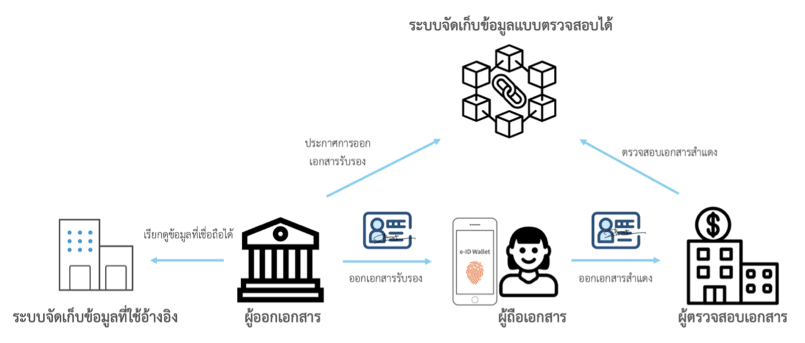
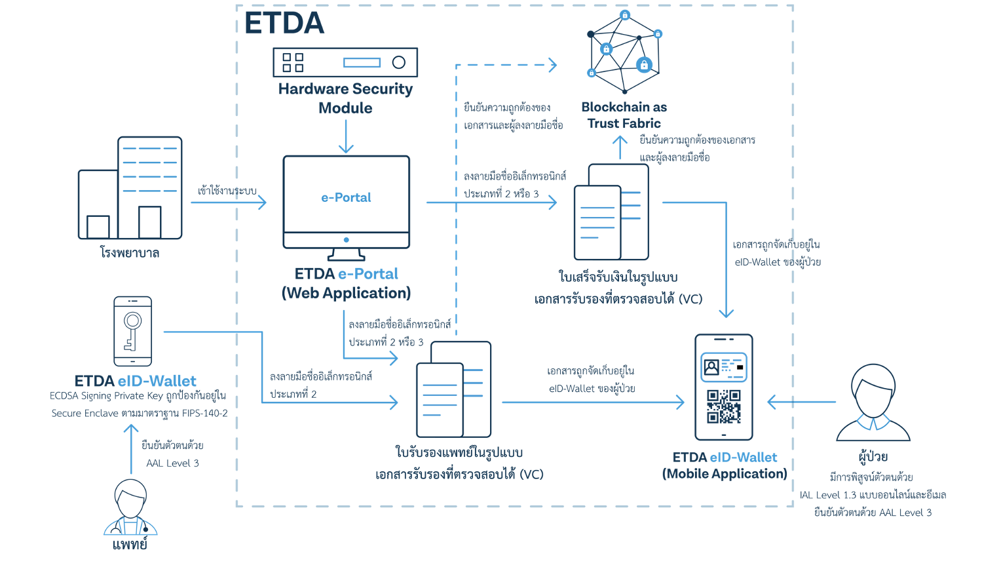
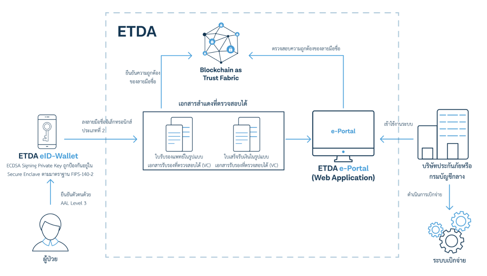

<h1 align="center">
Self Sovereign Identity: Overview
</h1>

    <a href="#where-can-i-find-">Where can I find ...</a> •
    <a href="#conceptual-overview">Conceptual Overview</a> •
    <a href="#about-this-project">About this Project</a>

## Where can I find ... 

This repository provides an overview over the Self Sovereign Identity project, and acts as a central storage for various useful documents related to the project. The table below acts as navigation aid to find the information you are looking for.

| Topic                   | Link                                            | Description                                                                  |
|-------------------------|-------------------------------------------------|------------------------------------------------------------------------------|
| Test Scripts               | [Test Script]                                 | All test scripts for SSI Application.                                           |
| Source Code      |  [Source Code] | A list of all other repositories which contains frontend and backend application. |

[Test Script]: https://github.com/orgs/ETDA/repositories?q=ssi-+script&type=all&language=&sort=
[Source Code]: https://github.com/orgs/ETDA/repositories?q=ssi+NOT+test&type=all&language=&sort=

## Conceptual Overview

## About this Project

The Self Sovereign Identity is the idea of individual should own and control their identity without the intervening administrative authorities. The concept of this project is to implement the system that can be used to the physical world without any issues.

In this application, the system mock the idea of medical certificate in the real world usage which can be useful for studying or implementing for the future.

Here is the process of the hospital creating the medical certificate and receipt for patient

Then, patient can use their medical certificate and receipt that hospital creating for them to present to the insurance company.

